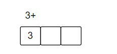
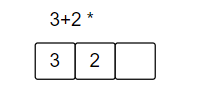
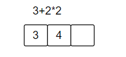

## 【leetcode】基本计算器II  C++/Go（栈）


**问题描述**

给你一个字符串表达式 `s` ，请你实现一个基本计算器来计算并返回它的值。

整数除法仅保留整数部分。

**示例 1：**

```
输入：s = "3+2*2"
输出：7
```

**示例 2：**

```
输入：s = " 3/2 "
输出：1
```

**提示：**

- `1 <= s.length <= 3 * 105`
- `s` 由整数和算符 `('+', '-', '*', '/')` 组成，中间由一些空格隔开
- `s` 表示一个 **有效表达式**
- 表达式中的所有整数都是非负整数，且在范围 `[0, 231 - 1]` 内
- 题目数据保证答案是一个 **32-bit 整数**


### 栈思想

想象一下，一个计算器怎么实现，一般来说都是使用栈这个数据结构来实现的。那么如何确定不同符号的优先级呢？

首先，`'*'`与`'/'`的优先级要高于`'+'`和`'-'`。那么我们制定一个策略：

- 当遇到`'*'`与`'/'`的时候，我们不将当前这个数字进行入栈操作，而是将这个数字与栈顶元素进行 符号运算，将运算结果更新为当前栈顶元素。
- 当遇到`'+'`和`'-'`时，我们直接将当前元素入栈，只不过特别的，对于`'-'`，我们入栈的是当前数字的相反数。

例如，对于下面的表达式
$$
3 + 2 * 2
$$
初始化符号presign = `'+'`,我们遍历到一个非数字符号的时候，我们将前面的数字入栈，前面的数字也就是数字3，然后我们可以将3直接入栈



往后继续，遇到符号 `'*'`，我们将前面的数字2入栈，更新当前的presign为`'*'`



到字符串最后一位也是一个结束的标志，我们需要将前面的数字进行入栈，但是当前的presign为`'*'`，我们将当前数字2与栈顶数字2进行相乘为4，然后更新为栈顶元素。



最后，将栈内所有的元素相加就能够得到最终的计算结果：
$$
3 + 4 = 7
$$


**C++实现**（vector模拟栈）

```cpp
func calculate(s string) int {
    n := len(s)
    nums := []int{}
    // 初始化
    num := 0
    var presign byte = '+'
    
    for i := 0; i < n; i++ {
        // 判断当前字符是否为数字
        isdigit := (s[i] >= '0' && s[i] <= '9')
        if isdigit {
            num = num * 10 + int(s[i] - '0')
        }
        if !isdigit && s[i] != ' ' || i == n - 1 {
            switch presign {// 各种不同符号的处理方法
                case '+':
                    nums = append(nums,num)
                case '-':
                    nums = append(nums,-num)
                case '*':
                    nums[len(nums)-1] *= num
                case '/':
                    nums[len(nums)-1] /= num
            }
            // 更新符号与数值
            presign = s[i]
            num = 0
        }
        
    }
    ret := 0
    for _, val := range nums {
        ret += val
    }
    return ret
}
```

**Go实现**（slice模拟栈）

```go
func calculate(s string) int {
    n := len(s)
    nums := []int{}
    // 初始化
    num := 0
    var presign byte = '+'
    
    for i := 0; i < n; i++ {
        // 判断当前字符是否为数字
        isdigit := (s[i] >= '0' && s[i] <= '9')
        if isdigit {
            num = num * 10 + int(s[i] - '0')
        }
        if !isdigit && s[i] != ' ' || i == n - 1 {
            switch presign {// 各种不同符号的处理方法
                case '+':
                    nums = append(nums,num)
                case '-':
                    nums = append(nums,-num)
                case '*':
                    nums[len(nums)-1] *= num
                case '/':
                    nums[len(nums)-1] /= num
            }
            // 更新符号与数值
            presign = s[i]
            num = 0
        }
        
    }
    ret := 0
    for _, val := range nums {
        ret += val
    }
    return ret
}
```


**注意：**

这个计算器还是比较简单的，只包括`('+', '-', '*', '/')`这四种运算符，还不包括括号运算符，并且数字都是非负整数。

---

参考：

- [227. 基本计算器 II - 力扣（LeetCode）](https://leetcode-cn.com/problems/basic-calculator-ii/)

