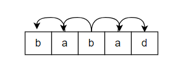
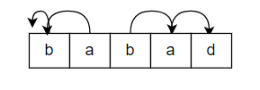
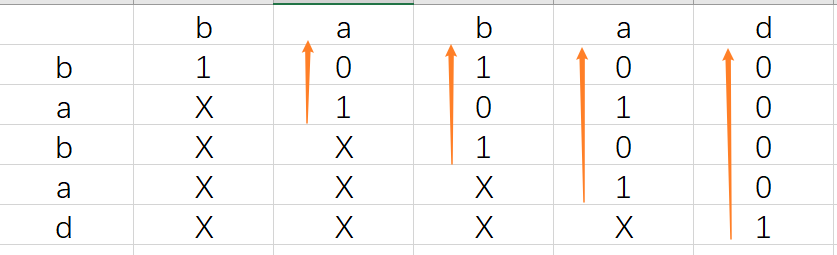

## 【leetcode-5-C++/Go】最长回文子串（中心扩散法+动态规划）


**题目描述**

给你一个字符串 `s`，找到 `s` 中最长的回文子串。

**示例 1：**

```
输入：s = "babad"
输出："bab"
解释："aba" 同样是符合题意的答案。
```

**示例 2：**

```
输入：s = "cbbd"
输出："bb"
```


### 中心扩散法

直接两张图就能够解释，如下是两种情况：

第一种：

由中间**一个字符**向左右两边进行扩散，当左右两端的字符相等时，继续扩散，否则停止，得到当前最长的回文子串。




第二种情况：

由中间的**2个字符**向左右两边进行扩散，当左右两端的字符相等时，继续扩散，否则停止，得到当前最长的回文子串。



C++实现：

```c++
// 中心扩散法
class Solution {
public:
    string longestPalindrome(string s) {
        int n = s.length();
        if(n <= 1) return s;
        int begin = 0;
        int maxNum = 1;
        for(int i = 0;i < n-1;++i)
        {
            int tnum = 1;
            int ti = 1;
            while(i - ti >= 0 && i + ti < n && s[i-ti] == s[i+ti])
            {// 由中间的一个字符向两边扩散
                tnum += 2;
                if(tnum > maxNum) {maxNum = tnum;begin = i-ti;}
                ti++;
            }
            
            ti = 0;
            tnum = 0;
            while(i - ti >= 0 && i + 1 + ti < n && s[i-ti] == s[i + 1 + ti])
            {// 由中间的两个字符向两边扩散
                tnum+=2;
                if(tnum > maxNum) {maxNum = tnum;begin = i-ti;}
                ti++;
            }
            
        }
        return s.substr(begin,maxNum);
    }
};
```


Go实现

```go
// 中心扩散法
func longestPalindrome(s string) string {
    n := len(s)
    if n <= 1 {
        return s
    }
    begin := 0
    maxNum := 1

    for i := 0; i < n; i++ {
        // 由中间的一个字符开始扩散
        left := i - 1
        right := i + 1
        for left >= 0 && right < n && s[left] == s[right] {
            if right - left + 1 > maxNum {
                begin = left
                maxNum = right - left + 1
            }
            left--
            right++
        }
        // 由中间的2个字符开始扩散
        left = i
        right = i + 1
        for left >= 0 && right < n && s[left] == s[right] {
            if right - left + 1 > maxNum {
                begin = left
                maxNum = right - left + 1
            }
            left--
            right++
        }
    }
    return s[begin:begin + maxNum]
}
```


### 动态规划

可以列一个表格，对于解决字符串相关的动态规划，最好是列一个表格进行分析，这样便于找出字符串之间的转化规律。

下表中，X表示无用的单元格，1表示字符串s[j:i]是一个回文子串，0表示字符串s[j:i]不是一个回文子串。

| j/i  | b    | a    | b    | a    | d    |
| ---- | ---- | ---- | ---- | ---- | ---- |
| b    | 1    | 0    | 1    | 0    | 0    |
| a    | X    | 1    | 0    | 1    | 0    |
| b    | X    | X    | 1    | 0    | 0    |
| a    | X    | X    | X    | 1    | 0    |
| d    | X    | X    | X    | X    | 1    |


遍历的方向如下：




C++实现

```c++
class Solution {
public:
    string longestPalindrome(string s) {
        // 动态规划的表格存储的不是最长回文长度，而是子串是否是回文的标志
        int n = s.length();
        if(n < 2) return s;
        vector<vector<bool>> dp(n,vector<bool>(n,true));
        int maxi = 0,maxj = 1,maxLen = 1;
        for(int j = 1;j < n;++j)
        {
            for(int i = 0;i < j;++i)
            {
                if(s[i] != s[j])
                    dp[i][j] = false;
                else{
                    if(j - i < 3) dp[i][j] = true;
                    else dp[i][j] = dp[i+1][j-1];
                }
                if(dp[i][j])
                {
                    if(j - i + 1 > maxLen)
                    {
                        maxLen = j - i + 1;
                        maxi = i;
                        maxj = j;
                    }
                }
            }
        }
        return s.substr(maxi,maxLen);
    }
};
```

Go语言实现

```go
// 动态规划
func longestPalindrome(s string) string {
    n := len(s)
    if n <= 1 {
        return s
    }
    begin := 0
    maxNum := 1
    // == 创建二维动态数组并且初始化 ==
    table := make([][]bool,n)
    for i := 0; i < n; i++ {
        table[i] = make([]bool,n)
    }
    for i := 0; i < n; i++ {
        table[i][i] = true
    }
    // ============================

    // 动态规划进行迭代计算
    for i := 1; i < n; i++ {
        for j := i-1; j >= 0; j-- {
            if s[i] != s[j] {
                table[j][i] = false
            } else {
                if i - j >= 2 {
                    table[j][i] = table[j+1][i-1]
                } else {
                    table[j][i] = true
                }
            }
            if table[j][i] && i - j + 1 > maxNum {
                maxNum = i - j + 1
                begin = j
            }
        }
    }
    return s[begin:begin+maxNum]
}
```


[5. 最长回文子串](https://leetcode-cn.com/problems/longest-palindromic-substring/)


