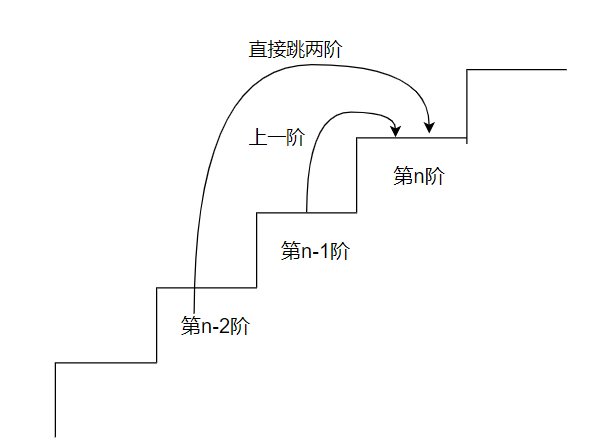

## 【leetcode】爬楼梯C++/Go（动态规划）


**题目描述**

假设你正在爬楼梯。需要 n 阶你才能到达楼顶。

每次你可以爬 1 或 2 个台阶。你有多少种不同的方法可以爬到楼顶呢？

**注意：**给定 *n* 是一个正整数。

**示例 1：**

```
输入： 2
输出： 2
解释： 有两种方法可以爬到楼顶。
1.  1 阶 + 1 阶
2.  2 阶
```

**示例 2：**

```
输入： 3
输出： 3
解释： 有三种方法可以爬到楼顶。
1.  1 阶 + 1 阶 + 1 阶
2.  1 阶 + 2 阶
3.  2 阶 + 1 阶
```


### 动态规划

**情况一：**

首先我们考虑基础情况，就是当n = 1的情况(即爬1阶的楼有多少种爬法)，很显然，只有一种，就是爬一阶到终点。


**情况二：**

这个情况就是一个递归的情况了，假设爬到第n阶台阶，有如下两种选择

1. 由上一个台阶(n-1)向上走一步。
2. 由上上个台阶(n-2)向上走两步。



那么假设假设到n阶台阶有dp(n)种走法，那么当n > 1时，有如下的递推式：
$$
dp(n) = dp(n-1) + dp(n-2)
$$


Go实现：

```go
func climbStairs(n int) int {
    // 动态规划思想
    if n <= 1 {
        // 基础情况
        return 1
    }
    dp := make([]int,n+1)
    dp[0] = 1
    dp[1] = 1
    // 带入公式进行迭代
    for i := 2; i <= n; i++ {
        dp[i] = dp[i-1] + dp[i-2]
    }
    return dp[n]
}
```


C++实现(改进版，不使用数组直接使用三个变量进行迭代，节省内存)：

```cpp
class Solution {
public:
    int climbStairs(int n) {
        // 基础情况
        if(n <= 1) return 1;
        int pre1 = 1,pre2 = 1;
        int cur;
        // 动态规划进行迭代
        for(int i = 2;i <= n;i++){
            cur = pre1 + pre2;
            pre1 = pre2;
            pre2 = cur;
        }
        return pre2;
    }
};
```


---

参考：

- [70. 爬楼梯 - 力扣（LeetCode）](https://leetcode-cn.com/problems/climbing-stairs/)

