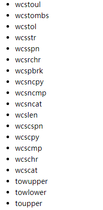
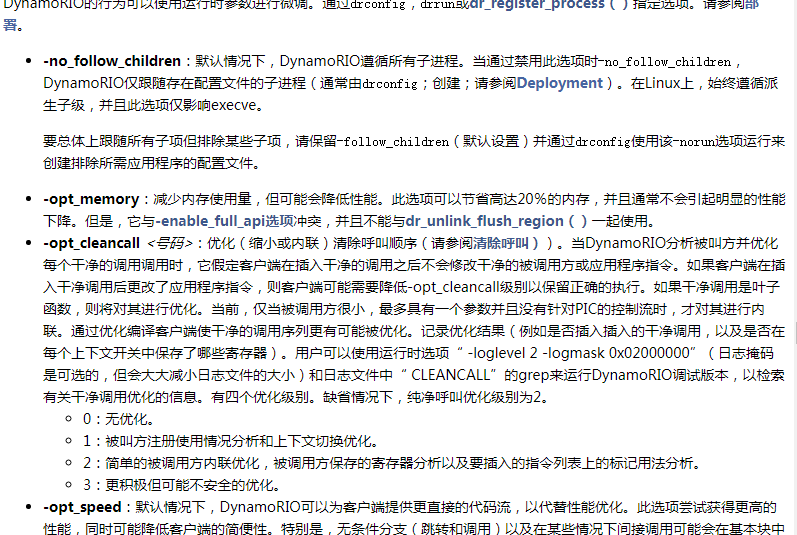
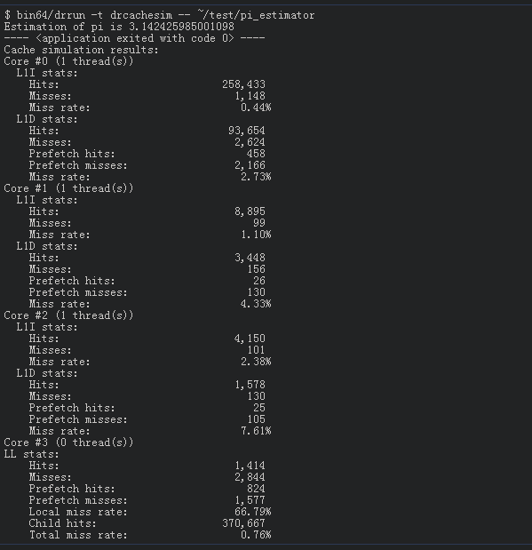
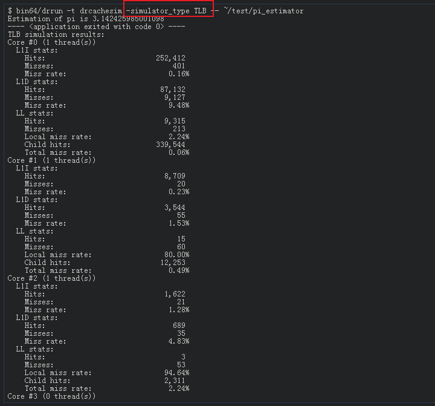

## 12.24


SQL注入及分类：

变量类型：字符型，数字型

HTTP提交方式：GET注入、POST注入、COOKIE注入

按注入方式分
报错注入
盲注
    布尔盲注
    时间盲注
堆叠注入


# DynamoRIO

---


## 参考

1. [程序运行时Trace：DynamoRIO Tool](https://zhuanlan.zhihu.com/p/82978299)
2. https://www.anquanke.com/post/id/218568
3. [https://www.anquanke.com/post/id/169257#h2-0](https://www.anquanke.com/post/id/169257#h2-0)
4. https://blog.csdn.net/m0_37921080/article/details/88104833
5. http://deniable.org/posts/binary-instrumentation/
6. https://bigtony666.github.io/-introduction-to-DynamoRIO/
7. https://bbs.pediy.com/thread-248995.htm
8. https://gitee.com/cbwang505/diydynamorio
9. https://bbs.pediy.com/thread-248995.htm
10. https://blog.csdn.net/m0_37921080/category_8702663.html
11. http://blog.topsec.com.cn/%E5%8A%A8%E6%80%81%E4%BA%8C%E8%BF%9B%E5%88%B6%E4%BF%AE%E6%94%B9dynamic-binary-instrumentation%E5%85%A5%E9%97%A8%EF%BC%9Apin%E3%80%81dynamorio%E3%80%81frida/


## 介绍

官网：[https://dynamorio.org/](https://dynamorio.org/)

源码：[https://github.com/DynamoRIO/dynamorio](https://github.com/DynamoRIO/dynamorio)

文档：[https://dynamorio.org/dynamorio_docs/](https://dynamorio.org/dynamorio_docs/)

## 安装

参考链接：[https://github.com/DynamoRIO/dynamorio/wiki/How-To-Build](https://github.com/DynamoRIO/dynamorio/wiki/How-To-Build)


## 使用

### 包含的工具

| 工具                                                         | 功能                                       |
| ------------------------------------------------------------ | ------------------------------------------ |
| [Dr. Memory](http://drmemory.org/)                           | 内存调试工具                               |
| [drcachesim](http://dynamorio.org/dynamorio_docs/page_drcachesim.html) | 多进程缓存模拟器和内存地址跟踪采集分析平台 |
| [drcpusim](http://dynamorio.org/dynamorio_docs/page_drcpusim.html) | 遗留处理器模拟器                           |
| [drstrace](http://drmemory.org/strace_for_windows.html)      | Windows轨迹工具                            |
| [drcov](http://dynamorio.org/dynamorio_docs/page_drcov.html) | 代码覆盖工具                               |
| [drltrace](http://dynamorio.org/dynamorio_docs/page_drltrace.html) | 库跟踪工具                                 |
| [memtrace](https://github.com/DynamoRIO/dynamorio/blob/master/api/samples/memtrace_x86.c) | 内存跟踪工具                               |
| [instrace](https://github.com/DynamoRIO/dynamorio/blob/master/api/samples/instrace_x86.c) | 指令跟踪工具                               |
| [bbbuf](https://github.com/DynamoRIO/dynamorio/blob/master/api/samples/bbbuf.c) | 基本块跟踪工具                             |
| [inscount](https://github.com/DynamoRIO/dynamorio/blob/master/api/samples/inscount.c) | 指令计数工具                               |
| [Dr. Fuzz](http://drmemory.org/docs/page_drfuzz.html)        | 动态模糊测试工具                           |


### 使用方法

在DynamoRIO下调用应用程序有两种方法：

1. 通过`drrun`进行配置与执行。
2. 通过`drconfig`配置，通过`drinject`执行。

即：

方法1：
`drrun -c <client> <client options> -- <app cmdline>`

方法2：
`drconfig -reg <appname> -c <client> <client options>`
`drinject <app cmdline>`

一个示例，下面的命令在DynamoRIO下使用bbsize在示例客户机运行ls：

```
./bin64/drrun -c samples/bin64/libbbsize.so -- ls
```

-c 表示所要执行的client，支持给client传参以及多个clients，并且client之间有优先级；-t表示指定的工具


运行drrun（不带选项）以获取它支持的选项和环境变量快捷方式的列表。要禁用跨子程execve调用的跟踪，请使用 [-no_follow_children](https://dynamorio.org/dynamorio_docs/using.html#op_children) 


> **两步的方法允许对子进程进行更大的控制。**
>
> `drconfig`工具为给定的应用程序名编写配置文件;DynamoRIO在运行时从配置文件中读取选项.一旦配置了每个进程名，就可以使用`drinject`工具调用父进程.
>
> `drrun`工具也可以使用，但它创建了一个临时配置文件，将覆盖通过`drconfig`请求的设置

**配置文件**

每个应用程序的配置文件存储在`$DYNAMORIO_CONFIGDIR/.dynamorio/<appname>.config32`（or a config64 suffix for 64-bit）中。

如果未设置`DYNAMORIO_CONFIGDIR`，则使用`$HOME/.dynamorio/<appname>.config32`；如果两者都未设置，则在创建新的配置文件以进行配置和运行执行时，将使用临时目录。

DynamoRIO也支持全局配置文件在`/etc/dynamorio/<appname>.config32`(当局部配置文件没有被找到的时候)

`drconfig`不支持直接编写全局配置文件，但可以从本地文件复制。

> DynamoRIO提供了丰富的API接口，开发者可以利用这些接口实现对**指令、基本块、线程、系统调用**等监控，从而实现二进制分析插件的开发。

### 客户端配置

参考：https://blog.csdn.net/m0_37921080/article/details/88104833


### 文件操作

参考：[https://blog.csdn.net/m0_37921080/article/details/87938468](https://blog.csdn.net/m0_37921080/article/details/87938468)

#### 打开文件

```cpp
file_t dr_open_file(const char *fname,  uint  mode_flags)  
```

该函数返回打开的文件的句柄。以 fname 为路径打开一个文件，如果这个文件不存在，则进行创建。

> 注意，尽量使用绝对路径。如果使用相对路径，则会利用进程初始化时设置的当前目录 以尽力而为的方式 转换为绝对路径。

文件打开的权限模式由 mode_flags 设定。mode_flags 的值是 DR_FILE_* 。比如下面的：

```
DR_FILE_READ
DR_FILE_WRITE_APPEND
DR_FILE_WRITE_ONLY
DR_FILE_WRITE_REQUIRE_NEW
...
```

#### 关闭文件

```cpp
void dr_close_file( file_t )
```

> 注意别忘了关闭文件，exit 事件的回调函数里关闭。

#### 向文件写字符串

```cpp
ssize_t dr_fprintf ( file_t f,const char *  fmt,...)	
```

向文件f 里写入格式化字符串。

> 注意这个命令除了可以向文件里写入内容，还可以向 STDOUT, STDERR 等写入内容。

#### 向文件写指令

```cpp
void instr_disassemble ( void * drcontext,instr_t * instr,file_t  outfile)	
```

向 outfile 文件里写入 instr 指令。

### 代码API

参考地址：[https://blog.csdn.net/m0_37921080/article/details/88080078](https://blog.csdn.net/m0_37921080/article/details/88080078)

#### 指令的表示

DynamoRIO 使用 instr_t 结构表示单个 IA-32 指令，使用`instrlist_t` 表示一串指令，比如一个基本块(basic block) 里的一串有序指令。在 `dr_ir_instrlist.h` 和 `dr_ir_instr.h` 头文件里， 列出了一系列的函数用来操作这两个结构体，主要包括以下几类：

- 创建一个新的指令
- 遍历指令的操作数
- 遍历 一个 instrlist_t 结构体
- 在 instrlist_t 里插入或者去除一个 instr_t

客户端通常以 基本块(basic block) 或者 trace 的方式与 instrlist_t 进行交互。
basic block 是一系列的指令，并且以一个控制转移操作结束。trace 则是高频率执行的一系列 basic block， 是由DynamoRIO 在程序执行时动态形成的。无论时 basic block 还是 trace ，都呈现出了控制流的线性视图。换句话说，指令序列只有一个入口，出口则有一个（basic block) 或多个（trace）。正是这种指令表示机制极大的简化了代码分析问题，并提高了 DynamoRIo 的效率。

指令表示法包括所有操作数，无论是隐式还是显式的，以及每条指令的条件代码效果（所谓代码效果，我觉得应该是对标志寄存器等造成的影响）。这有助于分析寄存器和条件代码的活跃性。

#### 事件

Client与DynamoRIO系统的主要交互是通过一组事件回调进行的。这些事件包括：

1. 基本块和跟踪的创建或删除
   - ([dr_register_bb_event()](https://dynamorio.org/dynamorio_docs/dr__events_8h.html#a043a3588c4cf0c2d6838140fce530e72) [dr_register_trace_event()](https://dynamorio.org/dynamorio_docs/dr__events_8h.html#a88a19a6822654caf18c017e145f48a57), [dr_register_delete_event()](https://dynamorio.org/dynamorio_docs/dr__events_8h.html#a698501b03d64f07e1a32fc82c021b27a))
2. 进程初始化并退出
   - ([dr_client_main()](https://dynamorio.org/dynamorio_docs/dr__api_8h.html#a2b938c98dd186cc94eef6880f9e3c3e9), [dr_register_exit_event()](https://dynamorio.org/dynamorio_docs/dr__events_8h.html#a985537df683007e1392e8a3b095ef363))
3. 线程初始化和退出
   - ([dr_register_thread_init_event()](https://dynamorio.org/dynamorio_docs/dr__events_8h.html#a878920c40c76e2c18043f9db772a24c0), [dr_register_thread_exit_event()](https://dynamorio.org/dynamorio_docs/dr__events_8h.html#a0b0c102bb9a99d67c3e62ea8b3790ff1))
4. Fork子初始化(仅限linux);用于重新初始化数据结构和创建新的日志文件
   - ([dr_register_fork_init_event()](https://dynamorio.org/dynamorio_docs/dr__events_8h.html#a82afd28406cbf06396e1a17ab100c6ea))
5. 加载和卸载应用程序库
   - ([dr_register_module_load_event()](https://dynamorio.org/dynamorio_docs/dr__events_8h.html#aca6b098123ef80cae05ce767a7dd9d98), [dr_register_module_unload_event()](https://dynamorio.org/dynamorio_docs/dr__events_8h.html#a2a40613f5e73d800acaeadd400bb1fab))
6. 应用程序故障或异常(Linux上的信号)
   - ([dr_register_exception_event()](https://dynamorio.org/dynamorio_docs/dr__events_8h.html#a69adae9409a1871149da69e97747b84c), [dr_register_signal_event()](https://dynamorio.org/dynamorio_docs/dr__events_8h.html#a3ac512c0bd9feea08cb04dd923efb589))
7. 核介导的控制转移([dr_register_kernel_xfer_event()](https://dynamorio.org/dynamorio_docs/dr__events_8h.html#a9999a8104aa51f967fb8acc33fb17b63))
   - 应用程序APC（异步过程调用）、回调或异常调度程序执行（Windows）
   - 应用信号传输（Linux）
   - 更改上下文的系统调用
8. 系统调用中断：系统调用前、系统调用后和系统调用按编号过滤
   - ([dr_register_pre_syscall_event()](https://dynamorio.org/dynamorio_docs/dr__events_8h.html#aa37d61a7f9dde4663b8dd4c3a44732f4), [dr_register_post_syscall_event()](https://dynamorio.org/dynamorio_docs/dr__events_8h.html#a099441f8d147404355c66178e3b19f0f), [dr_register_filter_syscall_event()](https://dynamorio.org/dynamorio_docs/dr__events_8h.html#a7ec572232450344efcba8923cae71d51))
9. 信号中断（仅Linux）
   - ([dr_register_signal_event()](https://dynamorio.org/dynamorio_docs/dr__events_8h.html#a3ac512c0bd9feea08cb04dd923efb589))
10. Nudge received - see [Communication](https://dynamorio.org/dynamorio_docs/using.html#sec_comm) ([dr_register_nudge_event()](https://dynamorio.org/dynamorio_docs/dr__events_8h.html#a9037603d0bd5bfca4198011adb8d10eb))

> 我将Client称为插桩程序。


一般情况下， 客户端会在`dr_client_main()` 函数里面进行回调函数的注册，然后DynamoRIO就会在适当的时机调用回调函数。

注意，一个客户端允许对同一个事件注册多个回调函数，同时DynamoRIO 也允许有多个客户端，并且多个客户端为同一个事件注册回调函数。对与这种情况，DynamoRIO 会以注册顺序的逆向来调用回调函数。此方案优先考虑先前注册的回调，因为它可以覆盖或者修改后注册的回调函数的操作。还有，当存在多个客户端时，DynamoRIo 根据客户端的priority （优先级）调用每个客户端的dr_client_main()。

每个事件都有一个特定的注册流程。例如：[dr_register_thread_init_event()](https://dynamorio.org/dynamorio_docs/dr__events_8h.html#a878920c40c76e2c18043f9db772a24c0)

- 头文件`dr_events.h`包含所有注册和取消注册方法的声明。

#### 转换与执行时间

当程序代码将要执行，将其从原位置转移到 code cache（DynamoRIO 的代码缓存空间）时，basic block 和 trace 的 事件会被提出。当code cache 里的代码执行时，不会提出 事件(event)。在典型的运行中，一个特定的 basic block 只会提出一次 event，也就是第一次运行，从 原位置转换到code cache 时；当它进入 code cache 之后，哪怕这段代码之后会多次运行，但都是直接从code cache 里面调用，而不会再提起 event。

basic block 的create event 提出时，就是程序代码将要被拷贝到 code cache ，这个时间点叫做 transformation time （转换事件）。在这个时间点，客户端可以插入指令去监视程序代码，或者直接修改程序的代码。经过检测或修改的代码在代码高速缓存内重复执行的时间就是执行时间。 所以我们要区分开 转换时间与执行时间。


### 构建自己的Client


计算指令的数量

#### abb_size

一个打印 basic block 的客户端

##### 导入头文件

```c
#include "dr_api.h"
#include <stdio.h>
```

##### 全局变量及相关函数的声明

```c
// 记录basic数量以及总指令数的结构体
typedef struct bb_counts {
	uint64 blocks;
	uint64 total_size;
} bb_counts;
static bb_counts counts_as_built;

file_t f;	// 全局日志文件
void *as_built_lock;// 全局互斥锁

static void event_exit(void);	// 退出函数注册
static dr_emit_flags_t event_basic_block(void *drcontext, void *tag, instrlist_t *bb,
	bool for_trace, bool translating);	// basic block粒度函数注册
```

##### 相关的函数实现

###### event_basic_block(插桩分析函数)

对于每一个basic block，都会调用这段代码。

> 我们不需要注册trace粒度的事件，所以我们可以忽略`event_basic_block`函数中的参数`for_trace`和`translating`

```c
static dr_emit_flags_t event_basic_block(void *drcontext, void *tag, instrlist_t *bb,
	bool for_trace, bool translating)
{
	uint num_instructions = 0;// 统计指令数
	instr_t * instr;//每串指令的开始指令指针

	 /* 在这个block里面计算指令的数量 */
	for (instr = instrlist_first(bb); instr != NULL; instr = instr_get_next(instr)) {
        num_instructions++;
        instr_disassemble(drcontext, instr, f);
        dr_fprintf(f, "\n");
	}

	dr_fprintf(f, "\n");
	
	/* 更新结构体的统计数量 */
	dr_mutex_lock(as_built_lock);
	counts_as_built.blocks++;
	counts_as_built.total_size += num_instructions;
	dr_mutex_unlock(as_built_lock);
	return DR_EMIT_DEFAULT;
}
```


###### event_exit(退出函数)

退出函数最后打印程序执行需要用到的basic block的数量以及平均每一个block执行的指令数。

```C
static void
event_exit(void)
{
	char msg[512];
	int len;
	len = snprintf(msg, sizeof(msg) / sizeof(msg[0]),
		"Number of basic blocks built : %llu \n"
		"     Average size            : %.5f instructions\n",
		counts_as_built.blocks,
		counts_as_built.total_size / (double)counts_as_built.blocks);
	DR_ASSERT(len > 0);
	msg[sizeof(msg) / sizeof(msg[0]) - 1] = '\0'; /* NUll terminate */
	DISPLAY_STRING(msg);
	
	/* 退出时 free mutex */
	dr_close_file(f);
	dr_mutex_destroy(as_built_lock);

}
```

> 注意，`dr_printf(),` `dr_messagebox()` 和 `dr_fprintf()`不能打印浮点数。

##### 主函数框架

```c
DR_EXPORT void
dr_client_main(client_id_t id, int argc, const char *argv[])
{
	dr_register_exit_event(event_exit);	// 注册退出时执行的函数
	dr_register_bb_event(event_basic_block); // 注册basic block粒度的插桩函数
	as_built_lock = dr_mutex_create();	// 初始化互斥锁
	// 打开日志文件
	f = dr_open_file("log.txt", DR_FILE_WRITE_APPEND );
	//	DR_ASSERT(f != INVALID_FILE);
}
```


## 基本组成

### 组成

此插桩平台主要包含以下内容：

1. DynamoRIO：负责解释并执行目标程序；提供丰富的跨平台API接口
2. Client ：通过API自定义分析操作来扩展DynamoRIO
3. DynamoRIO Extensions：主要指drmgr，drsyms，drwrap等官方提供的扩展接口


### 事件概念

DynamoRIO中有一个重要的概念：**事件**。

1. 应用程序事件：应用程序在动态执行时的事件，包括进程创建，模块加载，系统调用等
2. DynamoRIO事件：包括基本快、轨迹流的创建等
3. 事件回调函数的注册：`dr_register_xx_event`,`dr_ungister_xx_event`等

在DynamoRIO中，有两个重要的概念需要弄清：**transformation time** 和 **execution time**

> transformation time：DynamoRIO对待分析应用程序进行代码变换的时间
> execution time：待分析应用程序真正执行的时间


## 客户端的配置


## 工具API使用

### 使用模型

- 


请注意，允许插桩程序为同一个事件注册多个回调函数。DynamoRIO还支持多个插桩程序，每个插桩程序都可以注册相同的事件。

在这种情况下，DynamoRIO按照注册事件回调的相反顺序对事件回调进行排序。换句话说，第一个注册的回调最后接收事件通知。该方案优先于先前注册的回调，因为它可以覆盖或修改稍后注册的插桩程序的操作。

注意，DynamoRIO根据客户机的优先级调用每个客户机的`dr_client_main()`函数。

(参阅 [Multiple Clients](https://dynamorio.org/dynamorio_docs/page_deploy.html#multi_client) and [dr_register_client()](https://dynamorio.org/dynamorio_docs/dr__config_8h.html#ae9e35bfc0682dd3bee71eb8992d9eca3) in the deployment API).


插桩程序可以取消一个回调函数，通过一些正确的取消注册方法。（see [dr_events.h](https://dynamorio.org/dynamorio_docs/dr__events_8h.html)）

#### 基础功能

DynamoRIO为插桩程序提供了一个强大的实用程序库，用于自定义运行时代码转换。该接口包括对创建透明插桩程序的显式支持。

(请参阅[透明性](https://dynamorio.org/dynamorio_docs/transparency.html)一节，了解在与应用程序操作同一进程时保持透明性的重要性。)

DynamoRIO提供了客户端可以使用的公共资源，以避免依赖应用程序可能正在使用的共享库

客户端应该只通过DynamoRIO自己的API，通过DynamoRIO扩展(参见DynamoRIO Extensions)，通过直接系统调用，或通过与客户端通信的单独进程中的外部代理(参见通信)来使用外部资源。

如果第三方库是静态链接或私有加载的，并且不存在全局资源冲突的可能性，则可以使用它们。

(例如，第三方库的内存分配必须被包装）

参考： [Client Transparency](https://dynamorio.org/dynamorio_docs/transparency.html) 、[DynamoRIO Extensions](https://dynamorio.org/dynamorio_docs/using.html#sec_extensions)、[Communication](https://dynamorio.org/dynamorio_docs/using.html#sec_comm)、[Using External Libraries](https://dynamorio.org/dynamorio_docs/using.html#sec_extlibs)


DynamoRIO提供的API：

- 内存分配:线程私有（更快，因为它不会产生同步成本）和线程共享
- 线程局部存储
- 线程本地堆栈与应用程序堆栈分离
- 简单的互斥
- 文件创建、读写
- 地址空间查询
- 应用模块迭代器
- 处理器特征标识
- 额外线程创建
- 符号查找(当前仅Windows)
- 辅助库加载

(See [dr_tools.h](https://dynamorio.org/dynamorio_docs/dr__tools_8h.html) and [dr_proc.h](https://dynamorio.org/dynamorio_docs/dr__proc_8h.html) for specifics of each routine.)


DynamoRIO提供的另一类实用程序是用于解码、编码和操作IA-32、AMD64、ARM和AArch64指令的结构和函数API

(These are described in [Instruction Representation](https://dynamorio.org/dynamorio_docs/API_BT.html#sec_IR).)


此外，在Windows上，DynamoRIO提供了一些实用函数，它转发到一个核心的Windows系统库，我们相信客户端使用是安全的:




> DynamoRIO提供的打印函数可能不支持打印浮点数。


#### 64位的可达性

为了简化64位地址空间中的可达性，DynamoRIO保证其所有代码缓存都位于单个2GB内存区域内。

它还将通过dr_thread_alloc（）、dr_global_alloc（）、dr_nonheap_alloc（）或dr_custom_alloc（）分配的所有客户端内存放在同一区域中，并且dr_alloc_CACHE可访问。

DynamoRIO不保证其任何内存都分配在地址空间的较低4GB中。但是，它提供了一些功能，可以更轻松地绝对引用地址：

- 为了直接`var`在客户端库中引用全局变量，客户端可以使用地址创建操作数，`&var`它会自动转换为相对于pc的寻址模式。[OPND_CREATE_ABSMEM（）](http://dynamorio.org/dynamorio_docs/dr__ir__macros__aarch64_8h.html#a54b8bd667a8a940e94bfcc7842c958eb)直接创建相对于pc的操作数，而[opnd_create_abs_addr（）](http://dynamorio.org/dynamorio_docs/dr__ir__opnd_8h.html#a6c4e5d5376ce4dc1ba7081119d97a16d)将在绝对引用不进行编码时转换为相对于pc的操作数。一个[opnd_create_rel_addr（）](http://dynamorio.org/dynamorio_docs/dr__ir__opnd_8h.html#a429f69f7bc430cf278b5702818b25fcc)操作数也将转换为绝对引用，但不会到达pc相对引用。
- 将地址用作立即数时，请使用例程[instrlist_insert_mov_immed_ptrsz（）](http://dynamorio.org/dynamorio_docs/dr__ir__utils_8h.html#a271b766e4daebc20fcec8b9956855f6a)或[instrlist_insert_push_immed_ptrsz（）](http://dynamorio.org/dynamorio_docs/dr__ir__utils_8h.html#af91fbea9cd055925c4376e7858812c26)方便地插入一个或两个指令，具体取决于该地址是否在较低的4GB中。
- 当使用`instr_t`指针作为立即数时，请使用例程[instrlist_insert_mov_instr_addr（）](http://dynamorio.org/dynamorio_docs/dr__ir__utils_8h.html#aa7416ab72dd1f2edfaf7b99d2d7e2620)或[instrlist_insert_push_instr_addr（）](http://dynamorio.org/dynamorio_docs/dr__ir__utils_8h.html#a9a063518c87f568cfd3dfa514106c31a)方便地插入一个或两个指令，具体取决于生成的[instr_t](http://dynamorio.org/dynamorio_docs/structinstr__t.html)编码地址是否在较低的4GB中。

#### 字符串编码

DynamoRIO API中的所有字符串，无论是输入参数还是输出参数，都被编码为UTF-8。当与Windows内核交互时，DynamoRIO将在内部转换为UTF-16。客户端可以使用dr_snprintf()或dr_snwprintf()与S格式代码一起自行在UTF-8和UTF-16之间进行转换。(转发到ntdll的_snprintf()函数不会执行这种转换。)


#### 构建一个插桩程序

要使用DynamoRIO API，客户端应该包含主要的DynamoRIO头文件:

```cpp
#include "dr_api.h"
```

在包含DynamoRIO头文件之前，必须通过设置预处理器定义来指定客户机的目标操作系统和体系结构。然后必须链接相应的库。定义选择是:

1. `WINDOWS`, `LINUX`, or (coming soon) `MACOS`
2. `X86_32`, `X86_64`, `ARM_32`, or `ARM_64`

我们一般就是：LINUX + X86_64

目前我们为Windows和Linux提供了一个私有加载器。使用私有加载，客户端使用应用程序使用的每个库的单独副本。

如果出于透明性原因（请参阅客户机透明性）故意禁用私有加载程序，则客户机应该是自包含的，并且不应该与应用程序共享库。如果没有专用加载程序，64位客户机必须注意通过设置首选基址，在DynamoRIO代码缓存的可访问范围内尝试加载自己，尽管系统加载程序可能并不总是遵循这一点。

DynamoRIO发行版提供了CMake配置文件，以便于使用适当的编译器和链接器标志构建客户机。CMake是一个跨平台的构建系统，可以生成makefile或其他开发系统项目文件。一个`DynamoRIOConfig.cmake`配置文件以及支持文件分布在cmake/目录中。


在它的CMakeLists.txt文件中，客户端应该首先调用find_package(DynamoRIO)命令。这可以选择一个version参数。这将把DynamoRIO添加为导入的目标。如果找到，客户端应该调用configure_DynamoRIO_client()函数来配置构建设置。下面是一个例子:

```cmake
add_library(myclient SHARED myclient.c)
find_package(DynamoRIO)
if (NOT DynamoRIO_FOUND)
  message(FATAL_ERROR "DynamoRIO package required to build")
endif(NOT DynamoRIO_FOUND)
configure_DynamoRIO_client(myclient)
```

发布包中的samples/CMakeLists.txt文件是另一个例子。DynamoRIOConfig的顶部也包含详细的说明。


配置时，可以传入DynamoRIO\u DIR CMake变量以标识包含DynamoRIOConfig.cmake文件。例如：

```
mkdir ../build
cd ../build
cmake -DDynamoRIO_DIR=$DYNAMORIO_HOME/cmake ../myclient
make
```


在调用cmake之前，需要配置编译器。如果在非默认的目标平台上使用gcc，则应该在调用cmake之前设置CFLAGS和CXXFLAGS环境变量。例如，当gcc的默认值为64位时，要配置32位客户端:

```
mkdir ../build
cd ../build
CFLAGS=-m32 cmake -DDynamoRIO_DIR=$DYNAMORIO_HOME/cmake ../myclient
make
```

请注意，应该为c++客户端设置CXXFLAGS，并且在从相同的配置(例如，samples/CMakeLists.txt)构建这两种类型的客户端时都应该设置CXXFLAGS。

如果客户机未使用CMake，则可以从中收集适当的编译器和链接器标志DynamoRIOConfig.cmake. 一种方法是调用CMake生成一个Makefile，然后使用VERBOSE=1进行构建。我们还总结了gcc 32位客户端所需的关键标志：

```
gcc -fPIC -shared -lgcc -DLINUX -DX86_32 -I$DYNAMORIO_HOME/include my-client.c
```


#### DynamoRIO扩展

DynamoRIO支持通过称为DynamoRIO扩展的单独库扩展提供给客户端的API。扩展旨在包括可能因功能过于昂贵而无法默认提供的功能，或包含许可要求使用单独库的第三方提供的功能。扩展既可以是在构建时与客户端链接的静态库，也可以是在运行时加载的动态库。专用加载程序用于加载动态扩展。

当前扩展提供符号访问和容器数据结构。每个扩展都有自己的文档，其功能和数据结构与主要API分开记录。请在此处[查看扩展](http://dynamorio.org/dynamorio_docs/page_ext.html)的完整列表：[DynamoRIO扩展](http://dynamorio.org/dynamorio_docs/page_ext.html)。

参考： [DynamoRIO Extensions](https://dynamorio.org/dynamorio_docs/page_ext.html).


#### 使用拓展库

客户端可以自由使用外部库，只要这些库不使用任何会干扰正在运行的应用程序的全局用户模式资源，并且只要Windows上不调用任何可警报的系统调用即可（请参阅[避免可](http://dynamorio.org/dynamorio_docs/using.html#sec_alertable)警报的系统调用）。尽管支持大多数非图形不可更改的Windows API例程，`libpthread.so`但是已知诸如Linux上的本机线程库会引起问题。

目前，我们为Windows和Linux提供专用的加载程序。客户端必须静态链接到所有库，或者使用我们的专用加载器加载它们，这对于以典型方式加载的共享库会自动发生。在进行私有加载时，客户端使用每个库的单独副本，而不使用应用程序使用的任何副本。这有助于防止重新进入问题（请参阅[资源使用冲突](http://dynamorio.org/dynamorio_docs/transparency.html#sec_trans_resource)）。即使进行这种分离，但是如果这些库使用全局资源，仍然会发生冲突。我们的私有加载器将主进程堆中的堆分配重定向到使用DynamoRIO的内部堆。加载程序还尝试隔离其他全局资源使用情况和全局回调。请提交有关使用专用加载程序时发现的任何透明性问题的报告。


#### 通信

由于透明度的限制（请参阅客户端透明度），DynamoRIO只能支持进出目标应用程序进程的某些通信通道。其中包括：

- DynamoRIO部署控制和运行时选项
- Nudges:因为轮询需要额外的线程，而DynamoRIO尝试不创建永久的额外线程，一种称为Nudges的机制是将数据推入流程的首选机制。Nudges用于通知DynamoRIO它需要重新读取它的选项，或执行一些其他操作。DynamoRIO还提供了客户端可以使用的自定义Nudges事件。See [dr_nudge_process()](https://dynamorio.org/dynamorio_docs/dr__config_8h.html#a9df3d364222898cebc24264a161e2a5f) and [dr_register_nudge_event()](https://dynamorio.org/dynamorio_docs/dr__events_8h.html#a9037603d0bd5bfca4198011adb8d10eb).
- 文件可以用来发送数据。外部进程可以等待该文件。
- 共享内存可用于双向通信。


#### 注释

DynamoRIO提供了一种二进制注释机制，允许目标应用程序直接与DynamoRIO客户机或DynamoRIO本身通信。

二进制注释由一个宏生成，该宏可以手动插入到目标程序的源代码中

目前DynamoRIO提供了2个简单的注释:

1. 通过其返回值指示目标应用程序是否在DynamoRIO下运行

   **DYNAMORIO_ANNOTATE_RUNNING_ON_DYNAMORIO()**

2. 当目标应用程序在DynamoRIO下运行并且启用了日志记录时，向DynamoRIO日志写入一条消息。

   **DYNAMORIO_ANNOTATE_LOG(format, ...)** 

注释可以在DYNAMORIO_ANNOTATE_LOG（）中声明为无效，或者在布尔DYNAMORIO_ANNOTATE_RUNNING_ON_DYNAMORIO（）中可以具有返回值。返回值可以在分支谓词中使用，以便某些目标应用程序的代码仅在DynamoRIO下执行，或者可以将其用于进程内通信以从DynamoRIO或其客户端获取仅在二进制转换期间可用的数据。

##### 注释程序

向目标应用程序添加注释主要是在所需程序位置调用注释宏的简单问题。宏在C头文件**include / annotations / dr_annotations.h中声明**，并且每个宏在语法上都类似于函数调用。具有返回值的注释可以用作表达式。DynamoRIO提供了定义注释的模块，客户端也可以提供包含自定义注释的模块。每个使用注释的编译单元必须与相应的注释模块静态链接。对于使用cmake的项目，便捷功能**use_DynamoRIO_annotations（target，srcs）**将配置指定的**src**与注释模块链接。

##### 检测注释

当DynamoRIO在目标应用程序中遇到注释时，它会以两种方式之一检测程序位置:：

- 返回值替换:DynamoRIO用一个常量返回值替换注释(此插装仅对具有返回值的注释有效)，
- 处理程序调用：DynamoRIO用对当前为注释注册的每个处理程序的调用来替换注释。对于具有返回值的注释，最后注册的处理程序的返回值将是在目标程序位置生效的值。


#### 创建自定义注释

DynamoRIO客户机开发人员可能希望创建新的注释，以便与目标应用程序进行特定于客户机的通信。例如，检查内存使用情况的客户机可能对目标应用程序中的变量有误报，这些变量在初始化后从未被引用过。create\u注释遍历创建新注释的过程，该注释允许目标应用程序开发人员显式地将任何变量标记为已定义的变量。


#### 微调DynamoRIO：运行时参数



### 诊断和报告问题

当使用像DynamoRIO这样的复杂系统时，诊断问题可能很困难。本节包含一些调试提示，并说明如何获取帮助。


#### 使用Debuggers(调试器)

要在Linux的调试器下运行应用程序，你可以像正常情况下一样在gdb下启动drrun:

```、
gdb --args path/to/drrun <options> -- path/to/app
```

因为可执行文件从drrun更改为应用程序，应用程序不能从gdb的提示符重新运行。


## 例子

1. Example1:bbcount
   分析notepad，统计其运行时的基本块信息，如图中所示，共有 6903773 个基本块得到执行。
2. Example2:inscount
   分析notepad，统计其运行的所有指令数目。
3. Example3:countcalls
   countcalls 用来分析程序运行时的跳转指令信息，下图展示了notepad的执行过程中的直接call指令、间接call指令和ret返回指令的数量统计。
4. Example4:bbsize
   bbsize用于分析程序运行时的基本块信息，如下图所示，信息包括基本块总数、最大基本块指令数、平均指令数。

## 其他工具

### drcachesim

drcachesim是一个DynamoRIO客户端，它收集内存访问跟踪，并将它们提供给在线或离线工具进行分析。默认的分析工具是一个CPU缓存模拟器，而其他提供的工具则计算诸如重用距离之类的度量。跟踪收集器和模拟器支持多个进程，每个进程都有多个线程。分析工具框架是可扩展的，支持创建可以在线和离线操作的新工具。

drcachesim由两个组件组成：跟踪器和分析器。跟踪器从每个应用程序进程中的每个线程收集内存访问跟踪。分析器使用跟踪（联机或脱机）并执行自定义分析。


#### 基本使用

使用-t选项指定drcachesim 给drrun去运行：

```
bin64/drrun -t drcachesim -- /path/to/target/app <args> <for> <app>
```

目标应用程序将在DynamoRIO跟踪客户机下启动，该客户机收集所有的内存引用并通过管道将它们传递给模拟器。任何子进程都将被跟踪并分析，它们的内存引用也将传递给模拟器。

例如：



#### 指定分析工具

除了CPU缓存模拟器之外，还可以使用其他分析工具对内存地址跟踪进行操作。可以通过-simulator_type参数选择使用哪个工具。

例如使用TLB分析器：




计算重用距离度量:

```
bin64/drrun -t drcachesim -simulator_type reuse_distance -reuse_distance_histogram -- ls
```


## 构建自己的CLient

