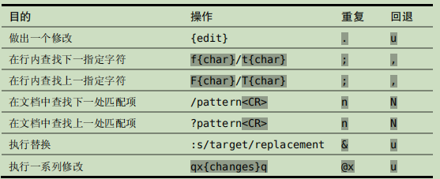
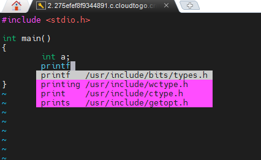
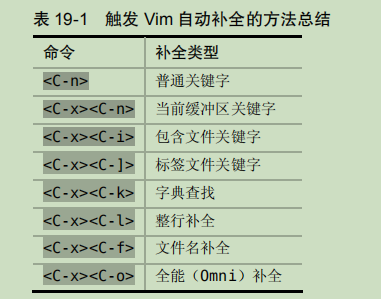

### 命令

1. shell中执行一个字符串命令

   ```shell
   cmd="echo hello world"
   $cmd	# way1
   eval $cmd	# way2
   ```

2. shell下单引号、双引号、反引号的区别

   - 单引号里的任何字符都会原样输出，单引号字符串中的变量是无效的；
   - 双引号里可以有变量，双引号可以出现转义字符
   - shell命令用反引号可以进行命令替换，是指shell能够将一个命令的标准输出插在一个命令行中任何位置。

3. sed命令对某一行进行操作

   https://blog.csdn.net/xj626852095/article/details/26101273

   ```
       y      在使用v模式选定了某一块的时候，复制选定块到缓冲区用；
       yy    复制整行（nyy或者yny ，复制n行，n为数字）；
       y^   复制当前到行头的内容；
       y$    复制当前到行尾的内容；
       yw   复制一个word （nyw或者ynw，复制n个word，n为数字）；
       yG    复制至档尾（nyG或者ynG，复制到第n行，例如1yG或者y1G，复制到档尾） 
   ```

4. 在vim中取消搜索的高亮

   ```bash
   :noh
   ```

5. vi/vim复制粘贴命令

   https://blog.csdn.net/lanxinju/article/details/5727262

6. 查询centos版本

   ```
   cat /etc/redhat-release
   ```

7. 解压tar.gz文件

   ```
   tar -zxvf ×××.tar.gz
   ```

8. 解压tar.bz2文件

   ```
   tar -jxvf ×××.tar.bz2
   ```

9. 刷新host

   ```
   /etc/init.d/network restart
   ```

10. 命令行对文件的某一行做处理

    1. 在指定行插入或追加: a, i
       a. 在test.txt第一行前插入：sed “1 i This is a test file” test.txt
       b. 在test.txt最后一行追加：sed “$ a This is the end of file” test.txt
    2. 删除： d
       a. 删除test.txt第二行： sed ‘2d’ test.txt
       b. 删除test.txt符合正则表达式`/fish`的行： sed ‘/fish/d’ test.txt

    https://blog.csdn.net/hs_err_log/article/details/79646376

11. shell中判断是centos7还是8、6

    ```shell
    v=`cat /etc/redhat-release|sed -r 's/.* ([0-9]+)\..*/\1/'`
    if [ $v -eq 6 ]; then
     	yum install scons -y
    fi
    if [ $v -eq 7 ]; then
     	yum install scons -y
    fi
    ```

12. shell 中的条件判断 “并且” “或者”  https://blog.csdn.net/lanyang123456/article/details/57416906

    or

    ```shell
    if [ c1 -o c2 ]; then
    …
    fi
    if [ c1 ] || [  c2 ]; then
    …
    fi
    ```

    and

    ```shell
    if [ c1 -a c2 ]; then
    …
    fi
    if [ c1 ] && [ c2 ]; then
    …
    fi
    ```

    [数字判断](https://blog.csdn.net/ithomer/article/details/5904632)

    ```
    int1 -eq int2　　　　两数相等为真
    int1 -ne int2　　　　两数不等为真
    int1 -gt int2　　　　int1大于int2为真
    int1 -ge int2　　　　int1大于等于int2为真
    int1 -lt int2　　　　int1小于int2为真
    int1 -le int2　　　　int1小于等于int2为真
    ```

13. 判断一个文件是否存在

    ```shell
    # 这里的-f参数判断$myFile是否存在
    if [ ! -f "$myFile" ]; then
    touch "$myFile"
    fi
    ```

    https://www.cnblogs.com/sunyubo/archive/2011/10/17/2282047.html

14. Apache httpd网页位置

    ```
    /var/www/html
    ```

15. Apache httpd配置文件

    ```
    /etc/httpd/conf/httpd.conf
    ```

16. Shell函数定义语法

    ```shell
    [ function ] funname [()]
    {
        action;
        [return int;]
    }
    ```

17. 在 Shell 脚本中调用另一个 Shell 脚本的三种方式

    ```
    fork: 如果脚本有执行权限的话，path/to/foo.sh。如果没有，sh path/to/foo.sh。
    exec: exec path/to/foo.sh
    source: source path/to/foo.sh
    ```

18. 刷新DNS

    ```
    yum install -y nscd
    systemctl restart nscd
    ```

    

19. 获取本机外网IP

    ```
    curl http://members.3322.org/dyndns/getip
    ```

20. 安装使用locate命令

    ```
    yum install mlocate -y
    locate libc.a
    ```

    1. top命令详解

    [top命令介绍_鲲鹏论坛_华为云论坛](https://bbs.huaweicloud.com/forum/thread-106249-1-1.html)

21. Linux下复制粘贴快捷键

    [Linux下复制粘贴快捷键 - 简书](https://www.jianshu.com/p/ece80a1cbabf)
    
22. 如何查看端口是否被占用？

    1. 使用`netstat`:

       ```shell
       netstat anp | grep 80
       ```

    2. 使用`lsof`:

       ```shell
       lsof -i:80
       ```

23. xargs使用方法

24. 查看文件权限

    ```
    ls -l 文件名称
    ```

    修改文件权限

    ```
    chmod 777 file
    ```

25. 


### Vim

1. `.`命令

   重复上一次的操作

2. `s`命令

   它先删除光标下的字符，然后进入插入模式

3. `%normal`

   对所以行执行后面的命令，例如在每行插入#

   ```
   %normal I#
   ```

4.  `f{char}`和`;`

   当我们输入  f+ 时，光标会直接移到下一个 + 号所在的位置。 ; 命令会重复查找上次  f 命令所查找的字符的下一个位置。

5. 撤销操作！

   

6. 替换命令

   ```
   :%s/content/copy/g
   ```

   

7. 

   


高级

- 自动补全

  通过 `<C-p>` 与 `<C-n>` 这两个组合键，我们不仅可以在插入模式下触发 Vim 的自动补全，而且还可以用它们在补全列表中反向或正向选择。

  

  

- 


技巧：

普通模式：

- 停顿时拿开画笔

- 把撤销单元切成块

- 构造可重复的修改

- 用次数做简单的算术运算

- 能够重复，就别用次数

- 双剑合璧，天下无敌

  操作符 + 动作命令 = 操作

插入模式：

- 在插入模式中可即时更正错误
- 返回普通模式
- 不离开插入模式，粘贴寄存器中的文本
- 随时随地做运算
- 

待学习：

-  `@:` 可以用来重复任意 Ex 命令
- 我们也可以输入  `&` （参见技巧 92）来重复上次的 :substitute 命令（它本身也是一条 Ex 命令）


### 命令行功夫

1. `.`操作可以重复上次执行的操作。
2. `>G` 命令会增加从当前行到文档末尾处的缩进层级。
3. 


### Linux常用命令？

- lsof
- tree
- ps
- top
- df -h
- debugfs -h
- gdb
- pstack
- scp
- wget
- 


