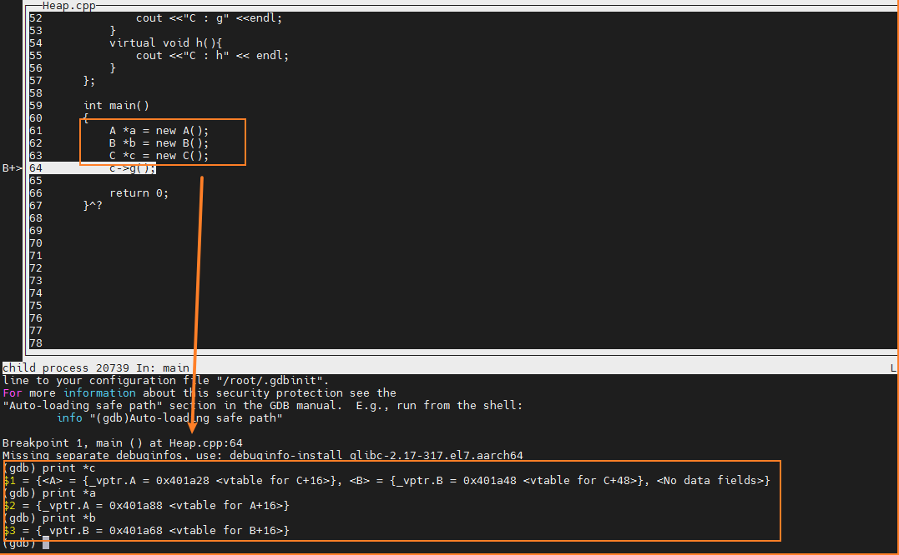
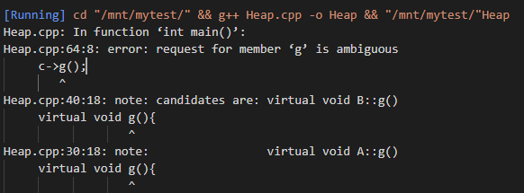

- [ ] C++多重继承下的虚函数指针情况



- 若继承的两个基类中都有同名的虚函数，但是子类没有实现这个虚函数，那么子类调用该同名虚函数的时候不知道调用哪个基类的虚函数，最终会报错。(编译时候就会报错)

  ```cpp
  class A{
      public:
      virtual void g(){
          cout <<"A : g" <<endl;
      }
      virtual void h(){
          cout <<"A : h" << endl;
      }
  };
  
  class B{
      public:
      virtual void g(){
          cout <<"B : g" <<endl;
      }
      virtual void h(){
          cout <<"B : h" << endl;
      }
  };
  
  
  class C:public A,public B{
      public:
      // virtual void g(){
      //     cout <<"C : g" <<endl;
      // }
      virtual void h(){
          cout <<"C : h" << endl;
      }
  };
  
  int main()
  {
      // A *a = new A();
      // B *b = new B();
      C *c = new C();
      c->g();
  
      return 0;
  }
  ```

  


- [ ] 最大堆的实现和堆排序的实现。

  ```cpp
  /***************************************
  Author: victor
  Filename: Heap.cpp
  Description: 最大堆的实现和堆排序的实现
  ***************************************/
  #include <iostream>
  #include <vector>
  using namespace std;
  class Heap{
      public:
          vector<int> nums;
          Heap(vector<int> &nums);
          ~Heap(){};
          int top();
          void push(int elememt);
          void pop();
          void adjustUp(int);
          void adjustDown(int,int);
          void sort();
          void display();
  };
  
  // init
  Heap::Heap(vector<int> &nums){
      this->nums = vector<int>(nums.size());
      for(int i = 0;i < nums.size(); ++i)
          this->nums[i] = nums[i];
      // build heap
      for(int i = (nums.size() - 2) / 2;i >= 0;--i)
          adjustDown(i,nums.size());
  }
  
  void Heap::adjustDown(int parent,int len)
  {
      int child = 2 * parent + 1;
      while(child < len)
      {
          if(child+1 < len && nums[child + 1] > nums[child])
              ++child;
          if(nums[child] > nums[parent])
          {
              swap(nums[child],nums[parent]);
              parent = child;
              child = 2 * parent + 1;
          }
          else{
              break;
          }
      }
  }
  
  void Heap::adjustUp(int child)
  {
      int parent = (child - 1) / 2;
      while(parent >= 0)
      {
          if(nums[child] > nums[parent])
          {
              swap(nums[child],nums[parent]);
              child = parent;
              parent = (child - 1) / 2;
          }
          else break;
      }
  }
  
  void Heap::sort()
  {
      // build heap 构造函数已经做了，这里无需再做
      for(int i = nums.size()-1;i > 0;--i)
      {
          swap(nums[i],nums[0]);
          adjustDown(0,i);
      }
  }
  void Heap::push(int num)
  {
  
  }
  
  void Heap::pop()
  {
      swap(this->nums[0],this->nums.back());
      this->nums.pop_back();
      adjustDown(0,nums.size());
  }
  
  int Heap::top(){
      return this->nums[0];
  }
  
  
  void Heap::display()
  {
      for(auto x: nums)
          cout << x << ' ';
      cout << endl;
  }
  int main()
  {
      vector<int> nums = {4,1,6,4,7,9,8};
      Heap h(nums);
      h.display();
      h.sort();
      h.display();
  
      return 0;
  }
  ```

  

- [ ] 