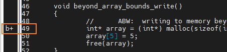
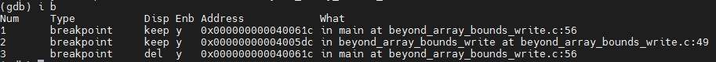
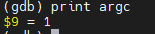
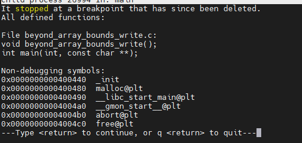
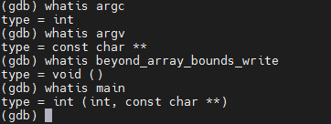

# GDB


## 启动gdb

```
gdb filename
```

或者直接输入`gdb`进入gdb调试器，然后执行下面的额命令

```
file filename
```

然后执行

```
（gdb） run
```

就能够执行程序进行调试

带画面的调试

```
gdb -tui
```


对运行的程序进行调试

```
gdb <program> <PID> 
```


## 常用命令

(以下全部命令都在gdb调试器内部使用)

### 显示、查询代码

**语法**

target可以是函数或者行号

```
l[list] target
```

**例子**

显示main函数的代码

```
l main  或者  list main
```

显示第20的代码附近(将显示当前文件以“行号”为中心的前后10行代码)

```
l 20  或者  list 20
```


### 设置断点

**语法**

参数target可以是行数，函数名。也可以用  `文件名：行数`  或者  `文件名：函数名`；

```
b[break] target
```

设置临时断点使用下面的语法(临时断点使用一次就删除了)

```
tb[tbreak] target
```

**例子**

在49行设置断点

```
b 49
```

在49行会出现断点标志




### 查看断点

查看断点

```
info b 或者 i b 或者 info break
```

Disp为keep的表示为普通断点，为del的则为临时断点，Enb是断点是否有效，y为有效，无效为n




### 清除断点

**语法**

删除第n行的断点

```
clear n
```

删除第n个断点

```
d[delete] n
```

暂停第n个断点

```
disable n
```

开启第n个断点

```
enable n
```


### 运行与调试

执行程序

```
r[run]
```

单步执行，进入函数体

```
s[step]
```

单步执行，不进入函数体

```
n[next]
```

遇到断点执行下面的语句继续执行

```
c[continue]
```

运行直到退出循环体

```
until
```

运行至某行，不仅仅用来跳出循环

```
until 行号
```

运行程序，直到当前函数完成返回

```
finish
```


### 设置观察

打印参数，打印表达式，表达式可以是变量，也可以是操作，也可以是函数调用

```
p[print] something
```




display 表达式：在单步运行时将非常有用，使用display命令设置一个表达式后，它将在每次单步进行指令后，紧接着输出被设置的表达式及值。如： 

```
display a
```

watch：设置一个监视点，一旦被监视的“表达式”的值改变，gdb将强行终止正在被调试的程序；

```
watch 表达式
```

查询函数信息

```
info function
```




target可以是变量或者函数，查询变量的类型或者函数的声明

```
whatis target
```



frame n：移动到指定的栈帧，并打印栈的信息，n为帧编号，如果不指定n，打印当前栈的信息；


### 设置信息

- set args 参数:指定运行时的参数
- 设置环境变量：set environment DUMA_PROTECT_BELOW 1

### 查询运行信息

- where/bt ：当前运行的堆栈列表；

  

- bt backtrace 显示当前调用堆栈

- up/down 改变堆栈显示的深度

  

- show args：查看设置好的参数

- info program： 来查看程序的是否在运行，进程号，被暂停的原因。


## 其他命令

### 分割窗口

- layout：用于分割窗口，可以一边查看代码，一边测试：
- layout src：显示源代码窗口
- layout asm：显示反汇编窗口
- layout regs：显示源代码/反汇编和CPU寄存器窗口
- layout split：显示源代码和反汇编窗口
- Ctrl + L：刷新窗口

查看当前所在目录

```
pwd
```


## 退出gdb

```
quit
```

